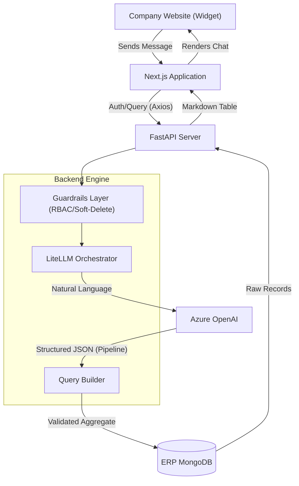
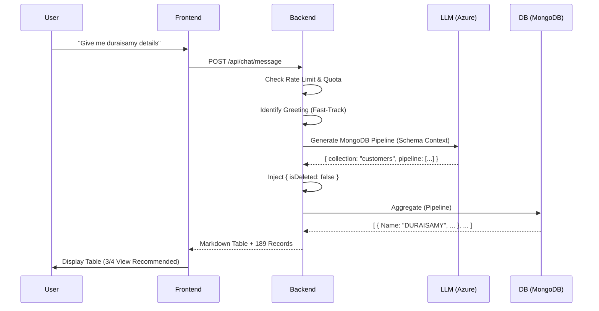
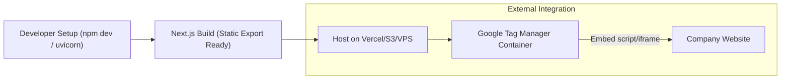
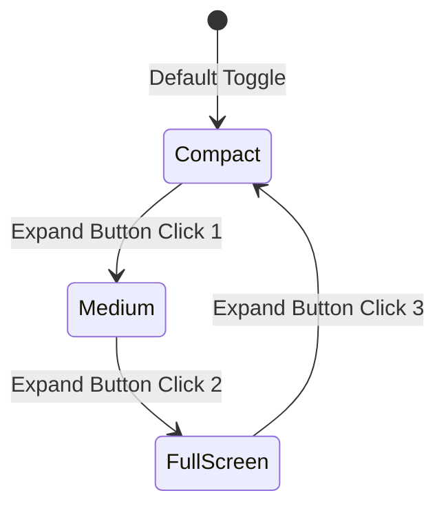

# Architecture & High-Level Workflows

This document visualizes the internal logic and deployment strategies of the InvyPro AI Chatbot.

---

## 🏗️ High-Level System Architecture

The following diagram illustrates the interaction between the frontend, backend, LLM providers, and the ERP database.

---

## ⚡ Data Flow Workflow

How a user question (e.g., *"Show me sales for store X"*) becomes a formatted data table.

---

## 🌐 Deployment & Integration Workflow

The process for taking the chatbot from development to a production company website.

### **Google Tag Manager Execution Steps**
1. **Container Ready**: Manager creates a GTM account and retrieves the Container ID.
2. **Implementation**: Container ID is placed in `layout.tsx`.
3. **Trigger**: GTM is configured to fire the Chatbot Loader script on all pages of `companywebsite.com`.
4. **Visibility**: The floating Chatbot bubble appears automatically for all site visitors.

---

## 📐 UI Resizing States

